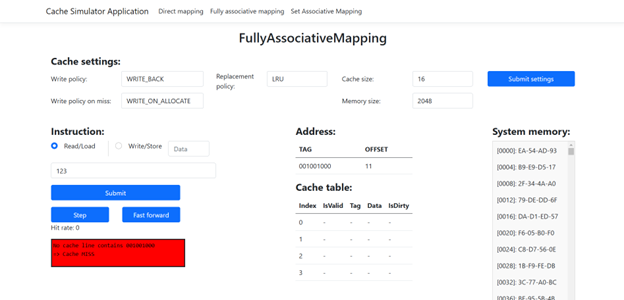

# CacheaSimulator

CacheaSimulator is a web application designed to simulate various cache memory mapping techniques such as Direct Mapping, Fully Associative Mapping, and Set-Associative Mapping. The simulator allows users to step through cache instructions (reads and writes), visualize cache state updates, and observe how different replacement and write policies affect cache performance.

## Features

- **Multiple Cache Mapping Techniques:**  
  Simulate Direct Mapping, Fully Associative, and Set-Associative cache configurations.

- **Step-by-Step Simulation:**  
  View detailed explanations of each cache operation (e.g., read/load, write/store) with dynamic updates and colored explanation messages (e.g., green for hits, red for misses).

- **Replacement Policies:**  
  Implement and compare various replacement policies (LRU, FIFO, etc.) for cache line replacement.

- **Write Policies:**  
  Supports multiple write strategies such as Write-Through, Write-Back, Write-Around, and Write-On-Allocate, with the ability to pass external data to the simulator.

- **Interactive UI:**  
  The application features an interactive web interface built with ASP.NET Razor Pages, allowing users to input instructions, view cache tables, and observe real-time changes in cache state.

## Prerequisites

- [.NET 6 SDK](https://dotnet.microsoft.com/download/dotnet/6.0) (or later)
- A modern web browser (Chrome, Firefox, Edge, etc.)

## Usage
- **Navigating the Simulator:**
    Upon launching the application, you can choose between different cache mapping policies (**Direct Mapping, Fully Associative Mapping, Set Associative Mapping**), cache instructions (e.g., **Read/Load, Write/Store**) using the provided radio buttons and input fields.

- **Step-Through Execution:**
    Use the Step button to execute cache instructions one-by-one. The simulator will update the cache table and display an explanation of what happened (cache hit/miss, valid bit check, tag comparison, etc.). Explanation messages will be dynamically colored (e.g., green for a cache hit, red for a miss).

- **Visualizing Cache State:**
    The simulator displays the current state of the cache, including cache lines, tags, valid bits, and dirty bits. You can observe how different instructions modify the cache state in real time.

- **Customizing Cache Parameters:**
    You can adjust cache size, block size, associativity, and other settings via the configuration section (if provided) or by modifying the source code.

## Screenshots

**Direct Mapping – Read/Load – Cache Miss:**

**Direct Mapping – Write/Store – Cache Hit:**

**Fully Associative Mapping – Read/Load – Cache Miss:**

